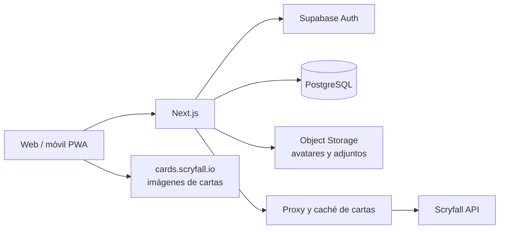

# Análisis y propuesta: red social para jugadores de Magic

> Estado: propuesta técnica inicial · 17 de septiembre de 2026

## Resumen ejecutivo

La idea es viable: una red de micropublicaciones para jugadores de *Magic: The Gathering* con perfiles, seguidores, feed, respuestas, favoritos y reposts, más decklists nativas y previsualización de cartas.

No conviene partir del repositorio oficial de Twitter/X. [`twitter/the-algorithm`](https://github.com/twitter/the-algorithm) contiene componentes del sistema de recomendaciones, no el frontend y backend completos del producto; además, no ofrece un build raíz ejecutable. Para este producto recomiendo una aplicación propia con una experiencia familiar, sin copiar marca ni recursos de Twitter/X. Así se puede diseñar el dominio de mazos desde el principio y entregar un MVP más pequeño.

**Base recomendada:** Next.js + TypeScript + PostgreSQL/Supabase + Scryfall. Empezaría con un feed cronológico y arquitectura modular; el ranking algorítmico, la federación y las aplicaciones móviles quedarían para después de validar el producto.

## Evaluación de alternativas

| Alternativa | Ventajas | Costes y riesgos | Decisión |
| --- | --- | --- | --- |
| Twitter/X `the-algorithm` | Referencia sobre recomendación | No es una aplicación completa ni un starter reutilizable | Descartada |
| [Mastodon](https://github.com/mastodon/mastodon) | Red social completa, moderación y ActivityPub | Ruby/React, operación compleja y licencia AGPL-3.0; integrar decklists profundamente sería costoso | Solo si la federación es requisito inicial |
| [Bluesky `social-app`](https://github.com/bluesky-social/social-app) | MIT, web y móvil, ecosistema AT Protocol | Es principalmente un cliente; el backend vive aparte y los forks deben cambiar marca, soporte y analítica | Interesante en una fase federada |
| Aplicación propia | Dominio, UX y despliegue bajo control; MVP más pequeño | Hay que implementar las funciones sociales básicas | **Recomendada** |

## Alcance del MVP

El primer lanzamiento debería permitir:

1. Registro, inicio de sesión, perfil, avatar, biografía y formatos favoritos.
2. Seguir, dejar de seguir, bloquear y silenciar usuarios.
3. Crear publicaciones de texto, responder, marcar como favorito y repostear.
4. Ver un feed cronológico de cuentas seguidas y perfiles públicos.
5. Crear, editar, duplicar, publicar e importar decklists.
6. Adjuntar una versión concreta de un mazo a una publicación.
7. Buscar cartas por nombre y ver imagen, texto Oracle, coste, tipo y legalidad sin subir imágenes.
8. Recibir notificaciones básicas y denunciar publicaciones o perfiles.

Quedan fuera del MVP: mensajes privados, vídeo, marketplace, torneos, recomendador personalizado, aplicación móvil nativa y federación.

## Arquitectura propuesta



- **Frontend y servidor web:** Next.js App Router, React y TypeScript. Los Route Handlers exponen API cuando sea necesaria; todas las mutaciones comprueban sesión y autorización en servidor.
- **Datos y autenticación:** Supabase aporta PostgreSQL, Auth y Row Level Security (RLS). Realtime se reservará para notificaciones, no para reconstruir todo el feed.
- **UI:** Tailwind CSS y componentes accesibles. Diseño responsive y PWA antes de plantear React Native.
- **Validación:** Zod compartido entre formularios, endpoints e importador.
- **Búsqueda inicial:** índices PostgreSQL Full Text Search y `pg_trgm`. Un motor externo solo tendría sentido cuando el volumen lo justifique.
- **Observabilidad:** logs estructurados, captura de errores y métricas de latencia, fallos de Scryfall y acciones de moderación.

Estructura sugerida:

```text
src/app/                 rutas y layouts
src/features/social/     posts, feed, follows y notificaciones
src/features/decks/      editor, importación y legalidad
src/features/cards/      cliente Scryfall, caché y visor
src/components/          componentes compartidos
supabase/migrations/     esquema, índices y políticas RLS
tests/e2e/               recorridos críticos de Playwright
```

## Modelo de datos esencial

- `profiles`: usuario público, nombre único, biografía y preferencias.
- `follows`, `blocks`, `mutes`: relaciones con claves únicas compuestas.
- `posts`: autor, texto, respuesta padre, visibilidad y fecha; `post_likes` y `reposts` guardan interacciones.
- `decks`: identidad del mazo, propietario, título, formato y visibilidad.
- `deck_versions`: instantáneas inmutables. Una publicación debe enlazar una versión, no el mazo mutable.
- `deck_cards`: versión, zona (`commander`, `mainboard`, `sideboard`, `maybeboard`), cantidad, `oracle_id` y `scryfall_id` opcional.
- `card_cache`: metadatos mínimos de Scryfall, URLs de imágenes y `updated_at`; no guarda binarios.
- `notifications`, `reports` y `moderation_actions`: actividad y trazabilidad administrativa.

El `oracle_id` agrupa la misma carta entre ediciones; `scryfall_id` identifica una impresión concreta. Si una lista importada no especifica edición, se conserva la identidad Oracle y se elige una impresión por defecto para mostrarla.

## Decklists y visor de cartas

### Flujo de edición

El usuario podrá pegar formatos habituales como `4 Lightning Bolt` y separar secciones con `Commander`, `Deck`, `Sideboard` o `Maybeboard`. El importador normaliza nombres, presenta las líneas ambiguas y nunca descarta silenciosamente una carta. El editor ofrece autocompletado con debounce, cantidades, cambio de impresión y resumen por colores, curva de maná y tipos.

La validación de formato debe ser informativa en el MVP: tamaño mínimo, límite de copias, identidad de color del comandante y legalidades devueltas por Scryfall. Las reglas especiales y cambios de banlist requieren pruebas y actualización controlada; no deben bloquear la conservación de una lista antigua.

### Integración con Scryfall

1. El navegador consulta un endpoint propio; las cabeceras, caché y limitación quedan en servidor.
2. El servidor usa autocomplete/búsqueda para editar y consultas por colección para resolver importaciones en lotes.
3. Se guardan identificadores y metadatos con caché temporal. Las imágenes se muestran desde las URLs de Scryfall; el usuario no las sube.
4. Para cartas de doble cara se leen las imágenes de `card_faces`; siempre existe un estado visual para imagen ausente o provisional.
5. Las listas usan imagen `small`; el modal usa `normal`. No se recortan, deforman ni cubren créditos o copyright.

Scryfall solicita menos de 10 peticiones por segundo a `api.scryfall.com`, cabeceras `User-Agent` y `Accept` identificables y uso de bulk data para cargas grandes. Aplicaremos caché, deduplicación, backoff ante `429` y un límite interno inferior. Las imágenes en `*.scryfall.io` se sirven directamente, pero se mantendrá un placeholder para evitar que una dependencia externa rompa la interfaz.

## Feed, rendimiento y evolución

El MVP usará **fan-out al leer**: una consulta indexada obtiene publicaciones propias y de cuentas seguidas, ordenadas por `(created_at, id)` con cursor. Es más simple y correcto para una comunidad inicial que precalcular timelines. Los contadores se actualizan transaccionalmente y cada favorito, follow o repost tiene una restricción única para ser idempotente.

Cuando haya datos reales se podrán añadir tendencias por formato, cartas o hashtags y un feed de descubrimiento. Antes de cualquier algoritmo complejo deben medirse retención, publicaciones vistas, follows y aperturas de decklists. No hace falta importar la infraestructura de recomendaciones de X para validar estas señales.

## Seguridad, moderación y aspectos legales

- Activar RLS y permisos mínimos en cada tabla expuesta; probar que un usuario no pueda editar recursos ajenos.
- Limitar registro, publicaciones, follows, importaciones y búsquedas; proteger endpoints contra spam y abuso automatizado.
- Sanitizar texto, validar MIME/tamaño de adjuntos y separar el rol de servicio del navegador.
- Incluir bloqueo, denuncia, cola de revisión, suspensión y registro de acciones desde el primer lanzamiento.
- Preparar exportación y borrado de cuenta, política de privacidad, términos y retención de datos antes de abrir registros públicos.

La marca debe ser propia: no usar nombre, logotipo ni apariencia que sugiera afiliación con Twitter/X, Wizards o Scryfall. La [Fan Content Policy de Wizards](https://company.wizards.com/es/legal/fancontentpolicy) permite sitios de fans bajo condiciones, exige dejar claro que el producto no es oficial y limita cómo se monetiza y usa su propiedad intelectual. Debe mostrarse el aviso de atribución requerido, mantener créditos de las cartas y revisar legalmente cualquier suscripción o paywall. Esto es una precaución de producto, no asesoramiento jurídico.

## Estrategia de pruebas

- **Unitarias (Vitest):** parser de decklists, agrupación de impresiones, reglas de cantidades y cursores del feed.
- **Componentes (Testing Library):** compositor, editor y visor, incluida navegación por teclado.
- **Integración:** políticas RLS, transacciones, idempotencia y respuestas simuladas de Scryfall.
- **E2E (Playwright):** registro → follow → publicación; importar → corregir → publicar mazo; abrir una carta de doble cara; bloquear y denunciar.

CI debe ejecutar tipos, lint, unitarias, migraciones en una base limpia y E2E críticos. Las pruebas no dependerán de Scryfall en vivo.

## Plan de entrega orientativo

| Fase | Resultado | Estimación para 1 desarrollador |
| --- | --- | --- |
| 0. Producto y legal | nombre, wireframes, formatos iniciales y políticas | 2–4 días |
| 1. Base | proyecto, auth, esquema, RLS, CI y diseño base | 1 semana |
| 2. Social | perfiles, follows, posts, feed e interacciones | 1–2 semanas |
| 3. Magic | Scryfall, importador, editor, visor y versiones | 1–2 semanas |
| 4. Lanzamiento | moderación, accesibilidad, rendimiento y beta | 1 semana |

Una beta pequeña es razonable en **4–7 semanas**, según el acabado visual, proveedores elegidos y profundidad de las reglas de formatos.

## Decisiones pendientes antes de implementar

1. ¿La primera beta será pública o por invitación?
2. ¿Qué formatos se soportarán primero: Commander, Standard, Modern, Pioneer o todos?
3. ¿Las decklists privadas y no listadas forman parte del MVP?
4. ¿Habrá monetización? Esta respuesta condiciona la revisión legal y la infraestructura.
5. ¿Se busca federación con ActivityPub/AT Protocol a medio plazo?

Si no hay preferencias, asumiría beta por invitación, Commander + formatos construidos principales, visibilidad pública/privada/no listada, sin monetización inicial y sin federación durante el MVP.

## Fuentes consultadas

- [Código del algoritmo de recomendaciones de X](https://github.com/twitter/the-algorithm)
- [Repositorio y licencia de Mastodon](https://github.com/mastodon/mastodon)
- [Repositorio, licencia y guía de forks de Bluesky Social](https://github.com/bluesky-social/social-app)
- [Documentación de la API de Scryfall](https://scryfall.com/docs/api)
- [Límites y buenas prácticas de acceso de Scryfall](https://scryfall.com/docs/faqs/i-m-having-trouble-accessing-the-scryfall-api-or-i-m-blocked-17)
- [Autenticación](https://supabase.com/docs/guides/auth) y [Row Level Security](https://supabase.com/docs/guides/database/postgres/row-level-security) de Supabase
- [Política de contenido de fans de Wizards of the Coast](https://company.wizards.com/es/legal/fancontentpolicy)
